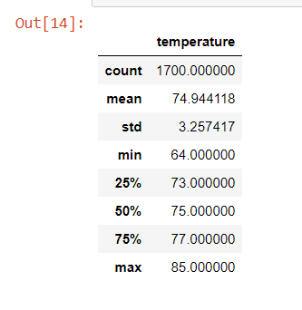
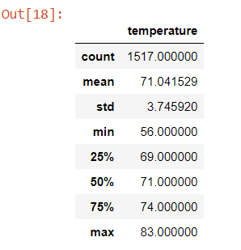

# Surf's Up with Advanced Data Storage and Retrieval

## Overview of the analysis

- The purpose of the analysis is to get the temperature data of Oahu, specifically the temperatures of days in June versus December, in order to determine if the surf and ice cream store is going to be sustainable year-round.

## Results

- The mean of the temperatures in June is around 75, and the mean of the temperatures in December is around 71, showing that Oahu's tempearture does not fluctuate too much during the year. 
- The standard deviation of June is around 3.26, and the standard deviation of December is around 3.75, making a 0.5 difference between the two months.
- The max temperature of June is 85, and the max of December is 83, only two degrees colder than it of June. The min temperature of June is 64, and the min temperature of December is 56. The min of December is 8 degrees colder than it of June, making a bigger difference than the difference of max temperature of the two months.

- 

- 

- [SurfsUp_Challenge.ipynb](SurfsUp_Challenge.ipynb)

## Summary

- Since the differences of means as well as standard deviations of the two months are not drastic, it is safe to conclude that the surf and ice cream store should be able to sustain year-round. It is entirely possible that they might still achieve slightly better sales in June versus December, but it is highly unlikely that they will see a drastic decrease in sales during the winter months.
- One query I would perform to gather more weather data for Juen and December would be looking at the humidity of each day in June versus December. 
- Another query I could potentially perform is looking at the speed of the wind or how strong the wind was for each day of those two months. 
